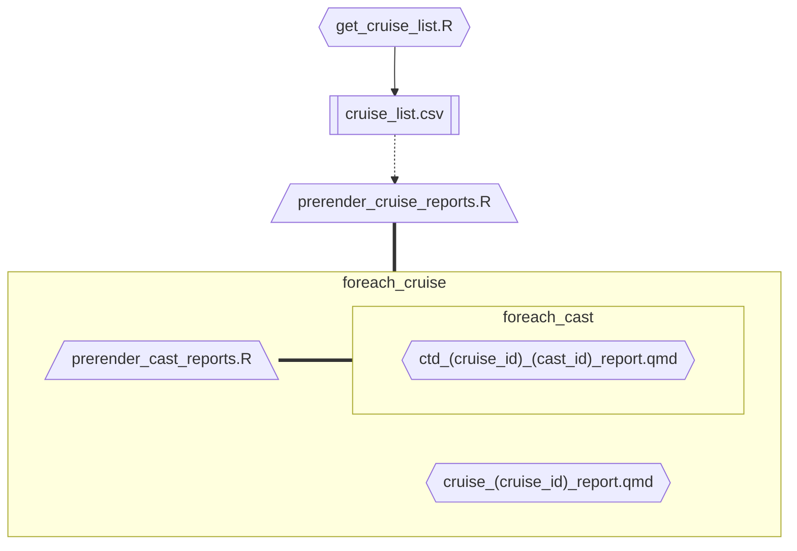

# seus-mbon-cruise-ctd-processing
CTD processing &amp; reporting for the SEUS MBON research cruise data

# Usage 
1. clone this repository
2. put data into `data/01_raw/cleaned_ctd_data`
3. build the site: `quarto render .` NOTE: You may need to run this twice; the first might just error.
4. view the site: `quarto preview .`
5. publish to github pages: `quarto publish`

# generated report structure
Running `quarto render` will complete several pre-render steps to create the following directory structure:

```tree
└── cruise_report/
    ├── cruise_report_template.qmd
    ├── ctd_report_template.qmd
    └── cruise_reports/
        ├── {cruise_id}/
        │   ├── {cruise_id}.qmd  <- generate_cruise_reports --  cruise_report_template
        │   └── ctd_reports/  
        │       ├── {ctd_id}.qmd <- generate_ctd_reports -- ctd_report_template
        │       └── ...
        └── ... 

```

The pre-render steps used to generate the above directory structure  are summarized by  the mermaid chart below.

