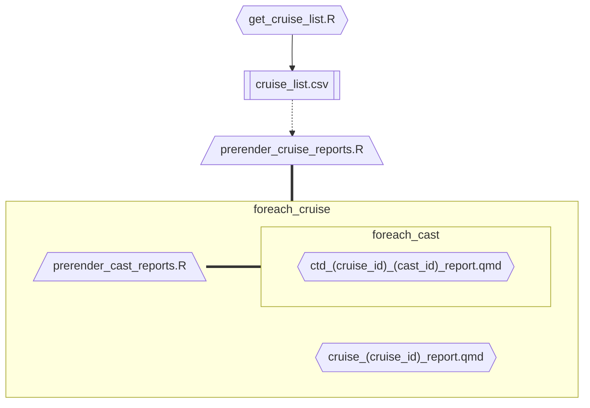

# CTD SFER / SE US MBON seus-mbon-cruise-ctd-processing
CTD processing &amp; reporting for the SEUS MBON research cruise data.

"Raw" data comes from https://gcoos5.geos.tamu.edu/erddap.
The data hosted there has already had some processing done, but this cleans it even further.

After processing the cleaned data will be in `./data/cleaned/`.
A version of the cleaned data is hosted by USF IMaRS at [here](https://usf.app.box.com/folder/263263938989?s=dvoi1ve0jn3apbdlad114uhn0pvmjool).

# Usage 
1. clone this repository
2. put data into `data/01_raw/raw_ctd_data`
   * raw "mostafa/combined_data_updated" with original names 
   *     "mostafa/raw_ctd_data_renamed" - stations renamed to align between cruises 
   *     "mostafa/cleaned_Cruises" - after oce cleaning 
      * see Cruise_naming_conventions.Rmd
3. build the site: `quarto render --no-cache`
    * NOTE: you can run with cache, but this may not generate the `data/cleaned/*.csv` files
4. view the site: `quarto preview`
5. publish to github pages: `quarto publish`

# generated report structure
Running `quarto render` will complete several pre-render steps to create the following directory structure:

```tree
└── cruise_report/
    ├── cruise_report_template.qmd
    ├── ctd_report_template.qmd
    └── cruise_reports/
        ├── {cruise_id}/
        │   ├── {cruise_id}.qmd  <- generate_cruise_reports --  cruise_report_template
        │   └── ctd_reports/  
        │       ├── {ctd_id}.qmd <- generate_ctd_reports -- ctd_report_template
        │       └── ...
        └── ... 

```

The pre-render steps used to generate the above directory structure  are summarized by  the mermaid chart below.

NOTE: this is out of date. The ctd_reports are not generated or rendered. Everything happens in the cruise_reports.


