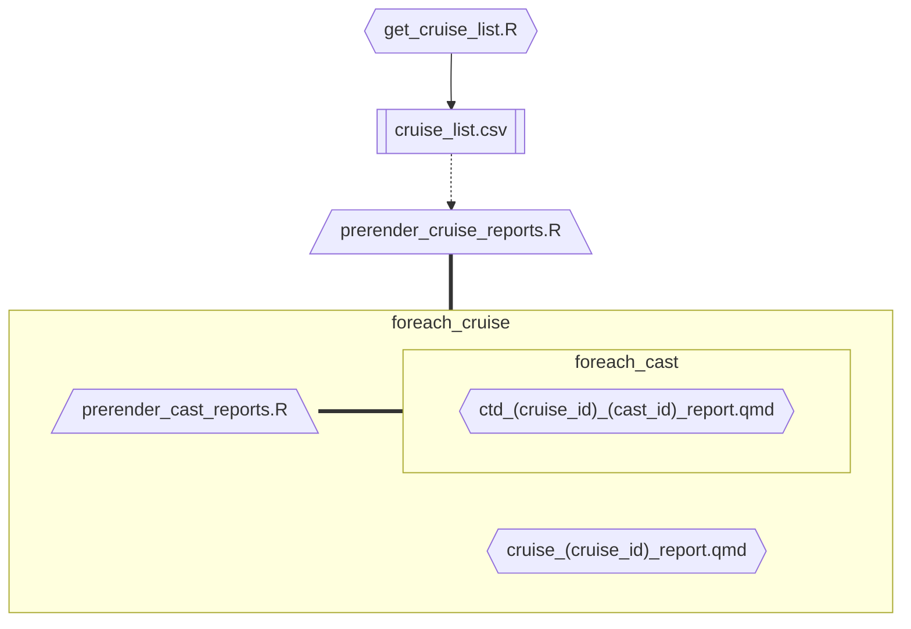

# seus-mbon-cruise-ctd-processing
CTD processing &amp; reporting for the SEUS MBON research cruise data

# Usage 
1. clone this repository
2. put data into `data/01_raw/combined_fl_keys_data`
3. build the site: `quarto render .`
4. view the site: `quarto preview .`
5. publish to github pages: `quarto publish`

