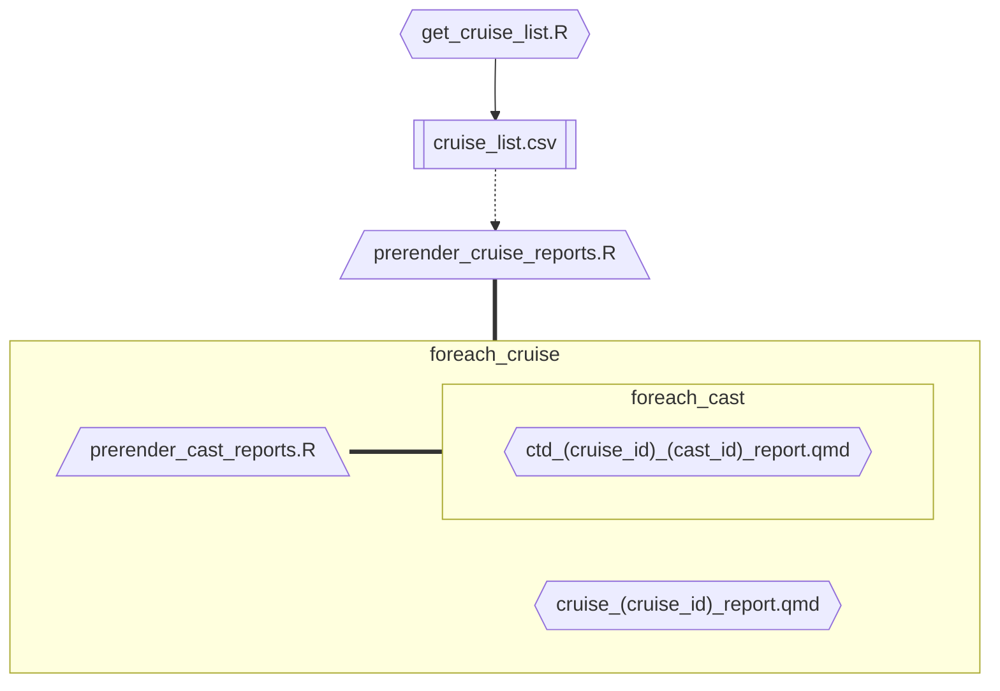

# seus-mbon-cruise-ctd-processing
CTD processing &amp; reporting for the SEUS MBON research cruise data

# Usage 
To build the site:

```bash
quarto render .
quarto preview .
```


```mermaid


graph TD

get_cruise_list{{get_cruise_list.R}}
  --> cruise_list[[cruise_list.csv]]

cruise_list -.->
prerender_cruise_reports[/prerender_cruise_reports.R\]
  === foreach_cruise 

%% rendering is implied for every .qmd
%% cruise_report -.->
%%   render{{render}}
%%   --> cruise_report_html[["cruise_(cruise_id)_report.html"]]

subgraph foreach_cruise
  cruise_report{{"cruise_(cruise_id)_report.qmd"}}
  prerender_cast_reports[/prerender_cast_reports.R\]
    === foreach_cast
end


subgraph foreach_cast
  cast_report{{"ctd_(cruise_id)_(cast_id)_report.qmd"}}
end

%% subgraph legend
%% script{{script.R}} 
%%   -- creates --> file[[file.txt]]

%% file -. depends .->
%%   report{{report.qmd}}

%% map[/map\]

%% reduce[\reduce/]

%%db[(database.sqlite)]

%% end
```